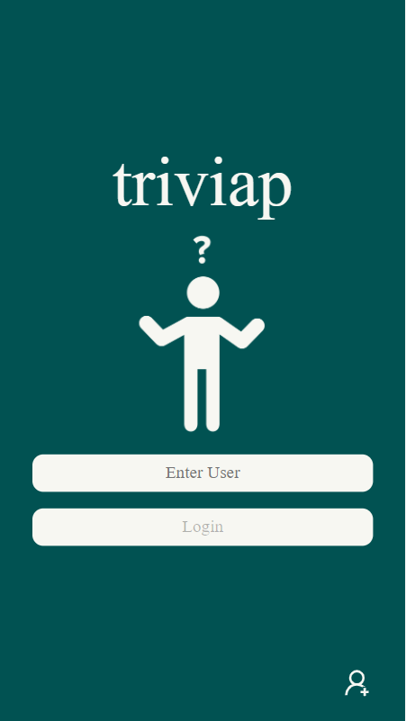
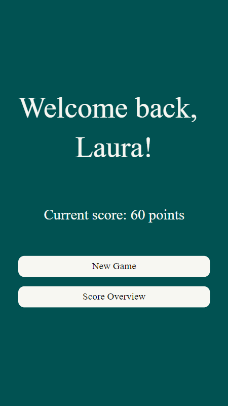
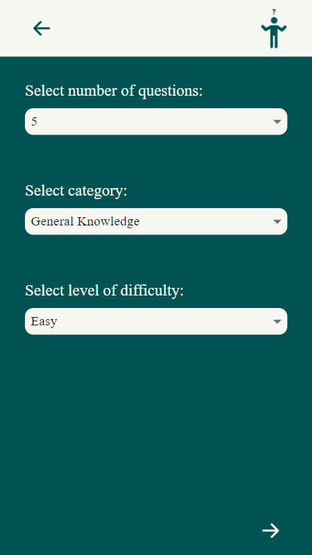
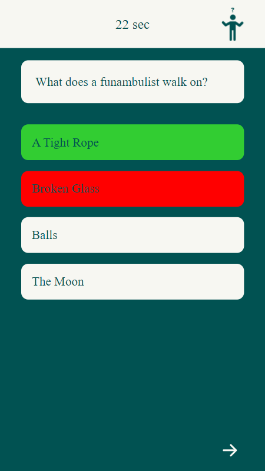
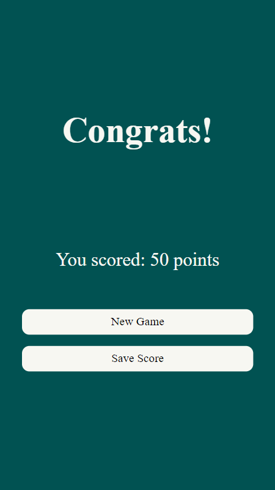
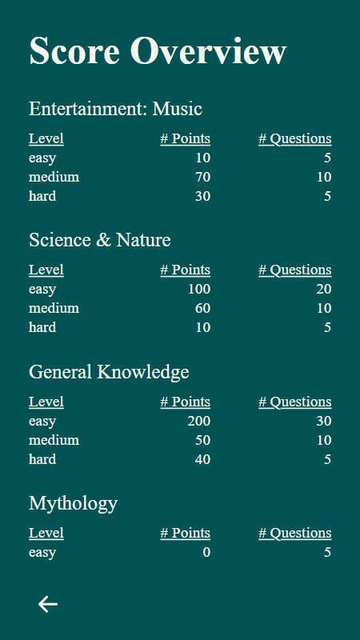

  

<h1 align=center>
triviap
</h1>

  
  
 
  
  

Who doesn't enjoy a game of Trivia on a rainy Sunday afternoon?

This app not only allows you to play your customized game, but also to save your points to allow you to compete against
yourself and others.

 

    
    
    
    
    
    

